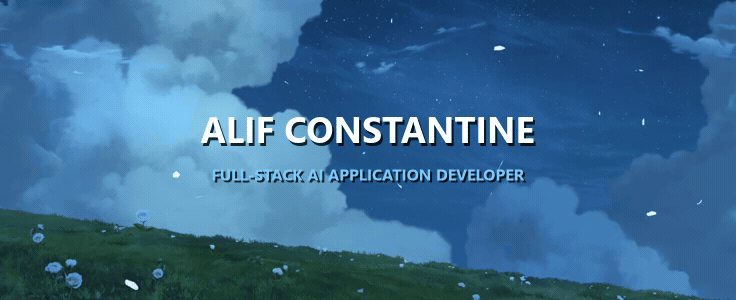

<div align="center">

<!-- Animated Pinterest Header Banner -->


<!-- Profile Badges Counter -->
<p align="center">
  
  
</p>

<!-- Social Badges -->
<p align="center">
  <a href="https://const-ai-eight.vercel.app" target="_blank"></a>
  <a href="https://linkedin.com/in/alifconstantine" target="_blank"></a>
  <a href="mailto:alifconstantine1@gmail.com"></a>
</p>

</div>


### About Me

```typescript
const alif: Developer = {
  name: "Alif Farhanul Hakim",
  role: "Full-Stack AI Application Developer",
  location: "Indonesia",
  focus: [
    "Generative AI & LLM Systems",
    "Agentic Workflows & Tool Calling",
    "Real-Time Reactive Architectures"
  ],
  stack: {
    frontend: ["Next.js", "React", "TypeScript", "Tailwind CSS"],
    backend: ["FastAPI", "Python", "Node.js"],
    database: ["Convex", "Supabase", "PostgreSQL", "pgvector"],
    ai: ["LangChain", "LlamaIndex", "Vercel AI SDK"]
  },
  currentGoal: "Building production-grade AI products for the global market"
};
```


### Tech Stack

<div align="center">

#### AI & Machine Learning
<p align="center">
  
  
  
  
  
</p>

#### Frontend & UI
<p align="center">
  
  
  
  
  
  
</p>

#### Backend, Database & Real-Time
<p align="center">
  
  
  
  
  
</p>

#### Tools & DevOps
<p align="center">
  
  
  
  
</p>

</div>


### Featured Projects

| Project | Description | Live Preview |
| :--- | :--- | :--- |
| **const-ai** | Full-stack AI application platform with real-time generative capabilities. | [const-ai-eight.vercel.app](https://const-ai-eight.vercel.app) |
| **VeriLensAI** | AI-driven visual inspection and verification platform. | [verilens-ai.vercel.app](https://verilens-ai.vercel.app) |
| **math-studio** | Interactive workspace for computational modeling and analysis. | [math-studio-cyan.vercel.app](https://math-studio-cyan.vercel.app) |
| **intelligent-operations** | High-performance interactive UI system and landing interface. | [View Repository](https://github.com/alifconstantine/intelligent-operations-landing-page) |


### GitHub Activity & Analytics

<div align="center">

<!-- GitHub Stats & Top Languages -->
<p align="center">
  
  
</p>

<!-- Commit Distribution Graph -->
<p align="center">
  
</p>

<!-- GitHub Streak Stats (New Official Domain) -->
<p align="center">
  
</p>

</div>


### Connect With Me

<div align="center">
<p align="center">
  <a href="https://linkedin.com/in/alifconstantine" target="_blank"></a>
  <a href="mailto:alifconstantine1@gmail.com"></a>
  <a href="https://github.com/alifconstantine" target="_blank"></a>
  <a href="https://t.me/alifconstantine" target="_blank"></a>
</p>
</div>


### Support My Work

<div align="center">
<p align="center">
  If you find value in my open-source projects or builds, consider supporting my work.
</p>
<p align="center">
  <a href="https://paypal.me/alifconstantine" target="_blank"></a>
  <a href="https://saweria.co/alifconstantine" target="_blank"></a>
</p>
</div>

<!-- Footer Wave Banner -->
<div align="center">


<p align="center">
  <sub>Built by Alif Constantine</sub>
</p>
</div>
